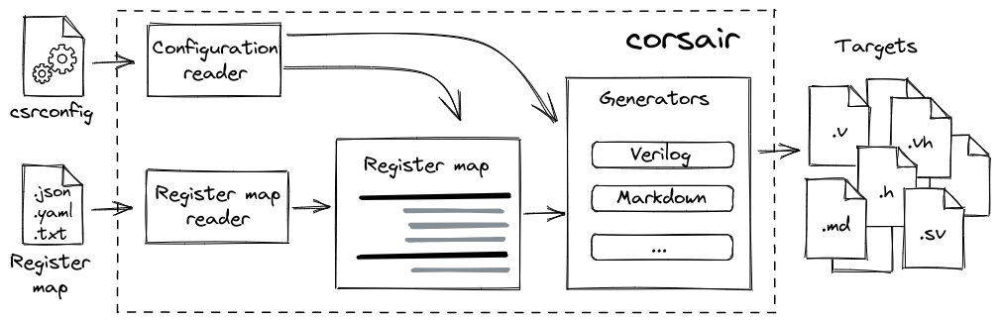

# Corsair


[](https://corsair.readthedocs.io/en/latest/?badge=latest)

[](https://badge.fury.io/py/corsair)


Corsair is a tool that makes it easy to create and maintain control and status register (CSR) map for any HDL project. It allows you to describe your register map in a single file and then generate HDL code, headers, documentation and other things. This effectively eliminates any mismatches between hardware, software and documentation of your IP-core.



## Features

- Various human-readable input formats: JSON, YAML or plain text table
- HDL code generation: Verilog or VHDL module with register map, Verilog header or SystemVerilog package with parameters and definitions
- Multi-protocol support: APB, AXI-Lite, Avalon-MM
- Documentation generation: Markdown, AsciiDoc
- Generation of software-related files: C header, Python module
- Extensibility: support of external file generators
- API: creation of custom workflow with corsair API

Corsair documentation is on the [ReadTheDocs.io](https://corsair.readthedocs.io).

## Install

Depending on your system, Python 3 executable might be `python` or `python3`.
If there any permissions issues, add `--user` key to the installation scripts.

To install the latest stable release:

```sh
python3 -m pip install -U corsair
```

## Quick start

The best way to start is to create templates. You can create one for a register map in a format you like (choose onе from `json`, `yaml`, `txt`) :

```sh
corsair -t yaml
```

This generates two files: one for register map in the format specified `regs.yaml`, and other for configuration - `csrconfig`.

Register map consists of a collection of memory mapped registers (also referred as CSRs), and registers are made up of bit fields. For example, register map of one register looks like this in YAML:

```yaml
regmap:
-   name: CTRL
    description: Control register
    address: 8
    bitfields:
    -   name: BAUD
        description: Baudrate value
        reset: 0
        width: 2
        lsb: 0
        access: rw
        hardware: o
        enums:
        -   name: B9600
            description: 9600 baud
            value: 0
        -   name: B38400
            description: 38400 baud
            value: 1
        -   name: B115200
            description: 115200 baud
            value: 2
```

To know more about registers, bit fields and their attributes please check the [Register map](https://corsair.readthedocs.io/en/latest/regmap.html) documentation page.

Corsair is configuration-file-oriented tool. By default, it uses INI configuration file `csrconfig`. It specifies all the things needed for generation - input register map file, global parameters and output files (also called targets). It may looks like this:

```ini
[globcfg]
data_width = 32
address_width = 16
register_reset = sync_pos

[v_module]
path = regs.v
interface = axil
generator = Verilog

[c_header]
path = regs.h
generator = CHeader
```

Check the [Configuration file](https://corsair.readthedocs.io/en/latest/config.html) page to get more details about `csrconfig` and the [Introduction](https://corsair.readthedocs.io/en/latest/introduction.html) page to get general information about workflow.

`csrconfig` also acts like a build script for corsair, so just run in the directory with `csrconfig` file:

```sh
corsair
```

And then all the magic happens.

There are some additional options for overriding working directory, register map or configuration file - to get help simply run

```sh
corsair -h
```

If you looking for some more examples please check `examples` folder.

## Development

Please follow the [Developer's Guide](https://corsair.readthedocs.io/en/latest/contributing.html).

## License

Corsair is licensed under [MIT License](LICENSE.txt).
