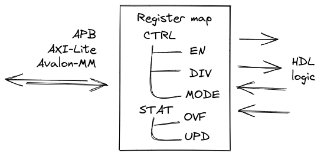

.. _regmap:

============
Register map
============

Register map is a special memory area that consists of named addresses called registers aka Control and Status Registers (CSR).
These registers, in turn, are made up of bit fields - group of bits with special properties.
When any register is accessed, collection of bit fields is read or written.

Register map usually is a part of an IP-core like timer, UART, SPI, USB, Ethernet and plenty of others.
It is used by software to rule the core.

From the hardware perspective, typical register map has bus interface (APB, AXI-Lite, Avalon-MM or other) on the one end,
and group of signals that integrates the map to HDL logic on the other end.

Register
========

As it said before, register map is nothing but collection of registers. Register have 4 main attributes:

================== =============================================================
Parameter          Description
================== =============================================================
``name``           Register name
``description``    Register description
``address``        Register address (offset from register map base address)
``bitfields``      List of register bit fields
================== =============================================================

Bit field
=========

.. image:: img/bitfield.svg
    :alt: Bit field
    :align: center

One level down register consists of one or more bitfields. Attributes of a bitfield:

=============== ================================================================
Parameter       Description
=============== ================================================================
``name``        Field name
``description`` Field description
``reset``       Reset value of the field
``width``       Field width (bits)
``lsb``         Field least significant bit (LSB) position
``access``      Access mode. One of the options below.
``hardware``    Hardware options. Options are below.
``enums``       Enumerated values for the field
=============== ================================================================

Access mode for the field is related to the bus accesses from software (or from one who drives the bus interface).  Use one of:

============ ================================================================================================================================
Access modes Description
============ ================================================================================================================================
``rw``       Read and Write. The field can be read or written.
``rw1c``     Read and Write 1 to Clear. The field can be read, and when 1 is written field is cleared.
``rw1s``     Read and Write 1 to Set The field can be read, and when 1 is written field is set.
``ro``       Read Only. Write has no effect.
``roc``      Read Only to Clear. The field is cleared after every read.
``roll``     Read Only / Latch Low. The field capture hardware active low pulse signal and stuck in 0. The field is set after every read.
``rolh``     Read Only / Latch High. The field capture hardware active high pulse signal and stuck in 1. Read the field to clear it.
``wo``       Write only. Zeros are always read.
``wosc``     Write Only / Self Clear. The field is cleared on the next clock tick after write.
============ ================================================================================================================================

Hardware options is used to define how bit field will interact with HDL logic. All the options are below.

================ =======================================================================================================
Hardware options Description
================ =======================================================================================================
``i``            Input. Use input value from hardware to update the field.
``o``            Output. Enable output value from the field to be accessed by hardware.
``c``            Clear. Add signal to clear the field (fill with all zeros).
``s``            Set. Add signal to set the field (fill with all ones).
``e``            Enable. Add signal to enable the field to capture input value (must be used with i).
``l``            Lock. Add signal to lock the field (to prevent any changes).
``a``            Access. Add signals to notify when bus access to the field is performed
``q``            Queue. Enable queue (LIFO, FIFO) access
``f``            Fixed. Enable fixed mode (field is a constant)
``n``            None. No hardware access to the field.
================ =======================================================================================================

Set of hardware options is just a string like ``q``, ``ioel``. There are few rules:

* Options ``n``, ``f``, ``q`` can be used only alone
* Any combination of ``i``, ``o``, ``u``, ``c``, ``s``, ``l``, ``a`` is allowed

These are just some ideas of how bit field access mode and hardware options can be combined with each other.
Of course, full list of possible combinations is quite bigger, but these ones cover most of the cases.

======== ======== ==================================================================================================================================================================
Access   Hardware Description
======== ======== ==================================================================================================================================================================
``rw``   ``o``    Values can be read and written from software. Hardware can only access the current value.
``rw``   ``ol``   Value that can be always read, but writing is done only when lock signal is inactive. Hardware can only access the current value.
``rw``   ``ioe``  Values that can be read and written from software. Hardware either can access the current value or update it.
``rw``   ``ioea`` Same as above, but hardware can also track when value was read or written by software.
``rw``   ``oc``   Values that can be read and written from software. Hardware can clean the value.
``rw``   ``os``   Values that can be read and written from software. Hardware can set the value.
``rw``   ``q``    Software can read and write data. Hardware transforms these accesses to the queue read/write operations.
``rw``   ``n``    Software can read and write data. But hardware has no access to the field.
``rw1c`` ``s``    Software can read current state and write 1 to clear the field. Hardware can set the value.
``rw1s`` ``c``    Software can read current state and write 1 to set the field. Hardware can clear the value.
``ro``   ``i``    Software can only read the field. Hardware assign current state to some internal variable.
``ro``   ``f``    Software can only read the constatnt value from the field. Hardware has no access to the field.
``ro``   ``ie``   Software can only read the field. Hardware can update the value when enable signal is active.
``ro``   ``q``    Software can only read data from the field. Hardware transform this to the queue read operation.
``roc``  ``ie``   Software can only read data from the field, field is cleared after read. Hardware can update the value when enable signal is active.
``roll`` ``i``    Value of the field will stuck at 0 when assigned hardware variable becomes 0. Software can only read data from the field, field is set after read.
``rolh`` ``i``    Value of the field will stuck at 1 when assigned hardware variable becomes 1. Software can only read data from the field, field is cleared after read.
``wo``   ``o``    Software can only write the field. Hardware can access the current value.
``wo``   ``q``    Software can only write data to the field. Hardware transform this to the queue write operation.
``wosc`` ``o``    Software can only write the field, the value will be cleared on the next tick. Hardware can access the field.
======== ======== ==================================================================================================================================================================

Enumerated value
=================

A bit field may have one or more special named values aka enumerated values aka enums.
In fact, they are just mnemonics assigned to specific values being read or written to the field.
Every enumerated value has 3 properties:

=============== ==================
Parameter       Description
=============== ==================
``name``        Enum name
``description`` Enum description
``value``       Enum value
=============== ==================

Input formats
=============

YAML
---------

YAML example:

.. code-block:: yaml

    regmap:
    -   name: CTRL
        description: Control register
        address: 8
        bitfields:
        -   name: BAUD
            description: Baudrate value
            reset: 0
            width: 2
            lsb: 0
            access: rw
            hardware: o
            enums:
            -   name: B9600
                description: 9600 baud
                value: 0
            -   name: B38400
                description: 38400 baud
                value: 1
            -   name: B115200
                description: 115200 baud
                value: 2
    -   name: ID
        description: IP-core ID register
        address: 4092
        bitfields:
        -   name: UID
            description: Unique ID
            reset: 3405645414
            width: 32
            lsb: 0
            access: ro
            hardware: f
            enums: []

More detailed example can be found in the `repository <https://github.com/esynr3z/corsair/tree/master/examples/regmap_yaml>`__.

JSON
----

JSON example is bit more verbose than YAML, but it is still the same register map:

.. code-block:: json

    {
        "regmap":[
            {
                "name": "CTRL",
                "description": "Control register",
                "address": 8,
                "bitfields": [
                    {
                        "name": "BAUD",
                        "description": "Baudrate value",
                        "reset": 0,
                        "width": 2,
                        "lsb": 0,
                        "access": "rw",
                        "hardware": "o",
                        "enums": [
                            {
                                "name": "B9600",
                                "description": "9600 baud",
                                "value": 0
                            },
                            {
                                "name": "B38400",
                                "description": "38400 baud",
                                "value": 1
                            },
                            {
                                "name": "B115200",
                                "description": "115200 baud",
                                "value": 2
                            }
                        ]
                    }
    						]
    		    },
    				{
                "name": "ID",
                "description": "IP-core ID register",
                "address": 4092,
                "bitfields": [
                    {
                        "name": "UID",
                        "description": "Unique ID",
                        "reset": 3405645414,
                        "width": 32,
                        "lsb": 0,
                        "access": "ro",
                        "hardware": "f",
                        "enums": []
                    }
                ]
            }
        ]
    }

More detailed example can be found in the `repository <https://github.com/esynr3z/corsair/tree/master/examples/regmap_json>`__.

TXT
---

Simple plain text format. Looks like Markdown table. The example below

.. code-block:: markdown

    | Address | Name   | Width | Access | Hardware | Reset      | Description      |
    | ------- | ------ | ----- | ------ | -------- | ---------- | ---------------- |
    | 0x0000  | DATA   | 32    | rw     | ioe      | 0x00000000 | Data register    |
    | 0x0004  | CTRL   | 16    | rw     | o        | 0x00000100 | Control register |
    | 0x0008  | STATUS | 8     | ro     | i        | 0x00000000 | Status register  |
    | 0x0100  | START  | 1     | wosc   | o        | 0x00000000 | Start register   |

It is much simpler than JSON/YAML formats, but it is just enough for many applications. However, you have to pay for this simplicity:

* Only one bit field per register is allowed. Columns Address, Name, Description store CSR attributes. Columns Width, Access, Hardware, Reset - bit field ones. LSB for this single bit field is always 0.
* No enums

More detailed example can be found in the `repository <https://github.com/esynr3z/corsair/tree/master/examples/regmap_txt>`__.
