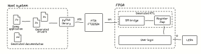

# CSR map with SPI interface



Simple example shows how to create FPGA firmware, that can be controlled from Python script on the host system.
For the simplicity there is only one register `LEDCTRL` to change RGB led state.

## File structure

- `rmap.json` - register map description file; source for the all generated files
- `demo.py` - demonstration application; top-level script to interract with a FPGA
- `rmap.py`, `drv_rmap.py` - drivers; generated scripts to handle all low level SPI communication via FTDI chip
- `top.sv` - FPGA top level with user logic, where all the components are instantinated
- `spi2lb_rmap.v`, `rmap.v` - generated bridge to convert SPI to LocalBus transaction and register map itself
- `rmap.md`, `rmap_img` - generated documentation for the register map
- `sdc.py`, `pinout.pcf`, `Makefile` - files, related to FPGA implementation process

## Register map generation

Use

```bash
corsair -r rmap.json --hdl --lb-bridge --docs
```

to regenerate all the artifacts with corsair.

## Requirements

### Hardware

- Lattice ICE5LP4K with RGB led connected
- FTDI FT2232H connected to FPGA via SPI

Use `make` to build bitstream and `make flash` to load it.

Bitstream was tested on [iCE40 Ultra Breakout Board](http://www.latticesemi.com/products/developmentboardsandkits/ice40ultrabreakoutboard), but code can be easily ported to any platform.

### Software

- [pyftdi](https://pypi.org/project/pyftdi/) library
- libusb-1.0 and udev rules - check [here](https://eblot.github.io/pyftdi/installation.html)